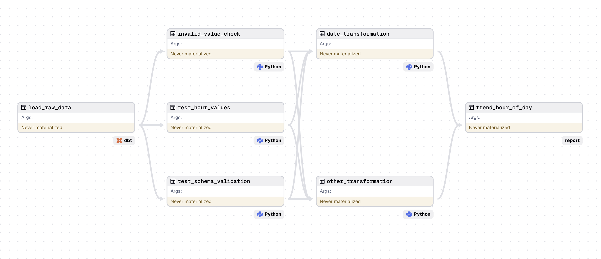

# Analysis Project: Data Quality and Reporting

This project addresses the assessment tasks provided, focusing on data quality checks, data modeling, and reporting insights. While some advanced concepts were only partially developed due to time constraints, the core solutions can be discussed.

## Project Overview

This repository contains the following key components:

- **`ratepay_project`**: A DBT (Data Build Tool) project for data transformation.
- **`ratepay_project/ratepay_dagster`**: A Dagster project for workflow orchestration.
- **`notebook/ratepay_analysis.ipynb`**: A Jupyter notebook with detailed analysis, visualizations, and solutions to the tasks.
- **`resources/`**: A directory containing the datasets used for this project.

## Technologies Used

- **Great Expectations**: Data quality checks to ensure the integrity and accuracy of datasets.
- **GitHub Actions**: CI/CD workflows for continuous integration and deployment.
- **Dagster**: Workflow orchestration tool to manage data pipelines.
- **DBT (Data Build Tool)**: For SQL-based data transformations.
- **Snowflake**: Cloud-based data warehouse for data storage and management.
- **SQL**: Used for both data transformation and data quality checks.
- **Python**: Programming language for additional data transformations and scripting tasks.

## Project Introduction

The notebook in this project, `ratepay_analysis.ipynb`, contains the complete implementation and visualization of the given tasks. To enhance the analysis, a proposed data workflow is included, which involves:

1. **Data Ingestion**: Extracting data from the Snowflake data warehouse.
2. **Data Transformation**: Transforming data using DBT for SQL-based tasks and Python for more complex operations.
3. **Workflow Orchestration**: Managing and orchestrating the workflow using Dagster, which includes Python-based transformations.
4. **Data Lineage**: A sample data lineage diagram is provided to illustrate the flow and transformation of data (see image above).

## Task 1: Data Quality Gates and Insights

### Insights
Share 3-5 key insights derived from the dataset:

1. **Purchase Patterns**: Identify patterns in purchase times and frequencies.
2. **Customer Segmentation**: Classify customers based on their purchasing behavior.
3. **Product Preferences**: Analyze trends in product categories to determine popular items.
4. **Payment Method Analysis**: Evaluate the correlation between payment methods and purchase frequency.
5. **Geographical Trends**: Examine regional differences in purchasing behavior.

### Data Quality Gates

To improve data quality, the following gates are recommended:

1. **Missing Value Analysis**: Calculate the percentage of missing (NaN) values for each column to decide on appropriate handling strategies.
2. **Invalid Value Checks**: Ensure that columns like `REGISTRATION_STATE_CGNDE` contain only valid state codes, avoiding invalid values like "??", "32", or "**".
3. **Schema Validation**: Use tools like Great Expectations to validate column data types, such as ensuring `FIRST_PURCHASE` and `LAST_PURCHASE` are of `datetime64` type.
4. **Uniqueness Check**: Verify the uniqueness of columns like `CUSTOMER_ID` using Great Expectations.
5. **Hour Value Validation**: Ensure `MOST_COMMON_HOUR_OF_THE_DAY_TO_PURCHASE` contains values within the valid range of 0-23.
6. **Weekday Value Validation**: Ensure `MOST_COMMON_WEEKDAY_TO_PURCHASE` contains values within the valid range of 1-7.
7. **Platform Purchase Validation**: Confirm that the sum of `WEB_PURCHASES`, `IOS_PURCHASES`, and `ANDROID_PURCHASES` equals the total `PURCHASE_COUNT_DELIVERY`.
8. **Purchase Categories Validation**: Verify that the sum of `MISC_PURCHASES`, `HOME_PURCHASES`, `COSMETICS_PURCHASES`, and `FASHION_PURCHASES` matches `PURCHASE_TOTAL_EUR`.
9. **Date Consistency Checks**: Ensure that `FIRST_PURCHASE` dates are earlier than or equal to `LAST_PURCHASE` dates, and that date formats are consistent.
10. **Payment Method Validation**: If `HAS_VALID_PAYMENT_METHOD` is True, ensure that `PURCHASE_COUNT_DELIVERY` is greater than zero.

### Data Cleaning

Data was cleaned based on the quality gates outlined above, ensuring the dataset is reliable for further analysis.

## Task 2: Data Modeling for Reporting

How would you model the data to report
1. Purchase trends

   a. Hour of the day

   b. Day of the week

   c. Days between first and last purchase

   d. Purchase value

   e. Average Order Value
2. Identify cohort of customers who are:

   a. Least likely to purchase in the following month.

   b. Most likely to purchase a marketing campaign.

